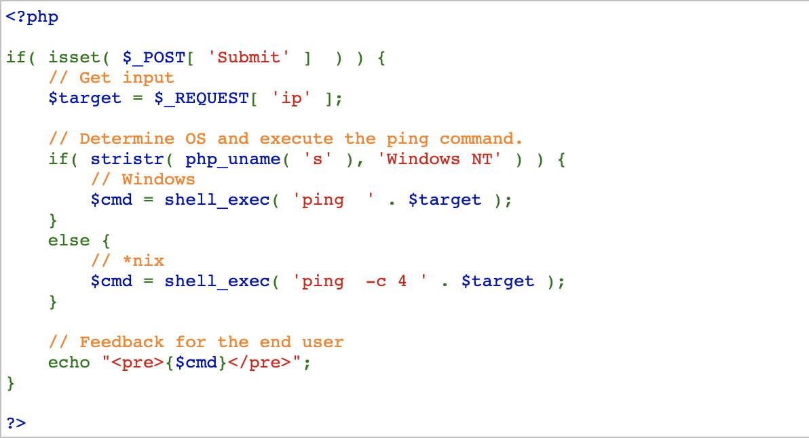
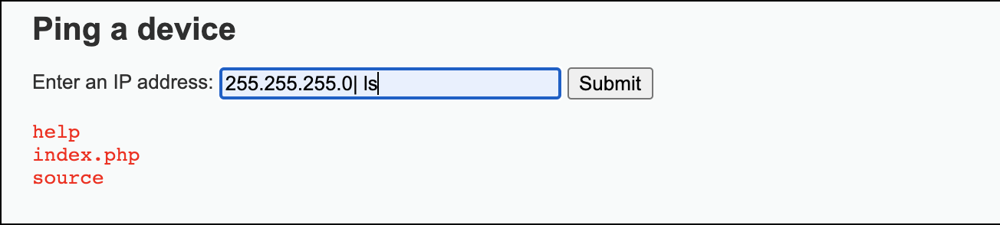
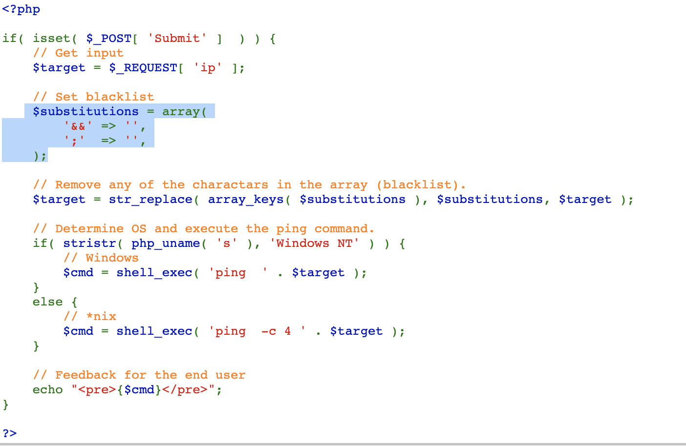
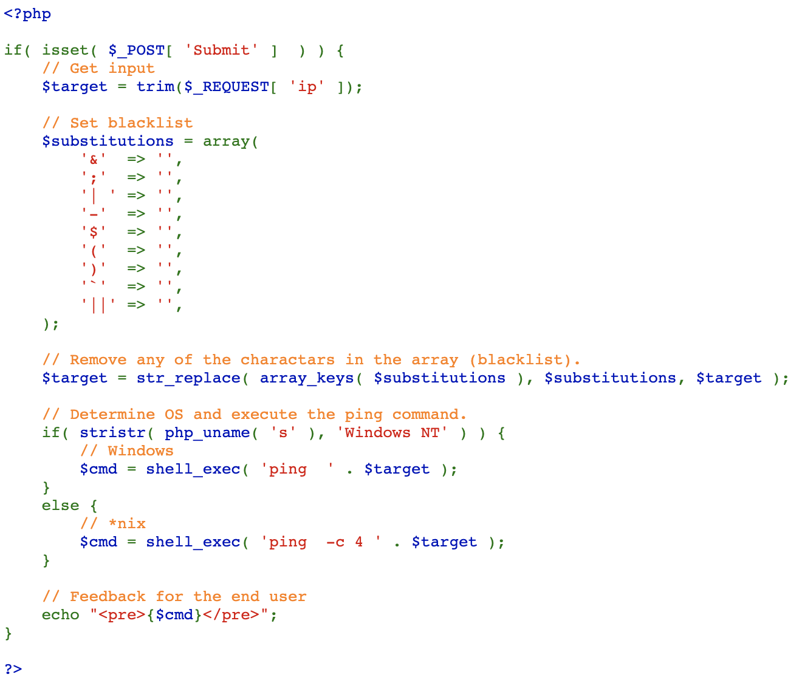

# Command Injection 
# 1. command injection의 정의 : 
This is an attack method calling a system command unintended by sending the data, after modifying an argument value of application calling the system command.

# 2. 문제풀이
## - low

여기서 주목해봐야 할 부분은 else부분의 shell_exec()인데, 이 함수의 역할은 다음과 같다.  
 shell_exec — Execute command via shell and return the complete output as a string

이와 같이 shell_exec()함수는 webshell을 작동시킬 수 있는 함수이다. 그리고 이를 통해서 command injection을 실행시킨다.  
해당 code에서는 $target 즉, 입력하는 ip주소에 대한 아무런 검사없이 통과시키므로 임의의 ip주소를 입력하고 ;을 입력하면 원하는 command를 뒤에 쓸 수 있다.

## - medium
 
혹시나 싶어서 ip주소 다음에 |을 입력했는데 통과가 되었다. 

그래서 source code를 살펴보니 다음과 같은 코드에서
str_replcae()함수로 array의 key가 발견될 경우 그 value로 치환하는 모습을 볼 수 있다.   command injection에 사용되는 character들은 |, &, ;이 있는데 여기서 |을 제외하고는 모두 sutitution이 되는 것을 알 수 있다.
  

## - high
 

아무리 이 코드를 들여다 봐도 어떻게 해야할지 모르겠어서 인터넷에 찾아보니 '| '만 검열이 되고  공백을 없앤 '|'은 검열이 안된다고 한다.
