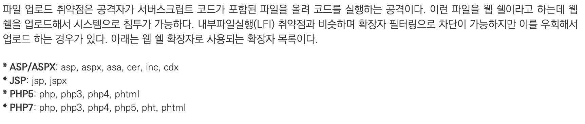

# File Upload
## 개념
사실 아직도 file upload의 정확한 개념은 모르겠지만, 일단 명확한 것은 php파일을 올리게 되면 그게 서버에서 실행된다는 것이다.
</br> </br> 
인터넷에서 찾은 정의는 다음과 같았다.</br></br>


## 문제풀이
</br>

## - low
low는 그냥 너무 별 것 없었다.</br>
```
<?php system("ls -l"); ?>
```
이런식으로 php code를 작성한 후 이를 올려주면 되었다.

## - medium
medium의 경우는 php파일의 확장자를 잠시 png로 바꾸어준 후에 command injection을 통해서 php로 확장자를 다시 수정해주면 되었다.

